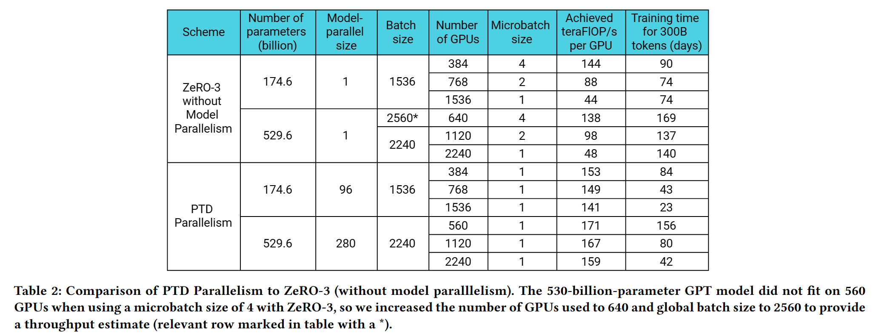

# Example Analyses with Megatron-LM Models

Below shows the `Table 2` in the paper [Efficient Large-Scale Language Model Training on GPU Clusters Using Megatron-LM](https://arxiv.org/abs/2104.04473).

## Training Analysis

llm-analysis are run with the setups described in the paper, and the outputs match the `Training time for 300B tokens (days)` reported for different schemes.

- For `PTD Parllelism` scheme, [run_train.sh](run_train.sh) is used and the output summaries are under [outputs_train](outputs_train).
- For  `ZeRO-3 without Model Parallelism` scheme, [run_train_zero.sh](run_train_zero.sh) is used and the output summaries are under [outputs_train_zero](outputs_train_zero)

## References
- [Efficient Large-Scale Language Model Training on GPU Clusters Using Megatron-LM](https://arxiv.org/abs/2104.04473)
- [ZeRO: Memory Optimizations Toward Training Trillion Parameter Models](https://arxiv.org/abs/1910.02054v3)
