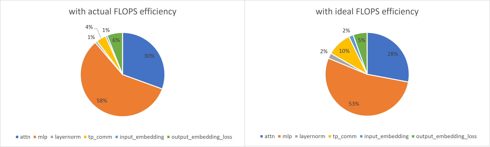

# Example Analyses with Megatron-Turing NLG 530B

The Megatron-Turing NLG 530B model has the following [configuration](../../llm_analysis/model_configs/mt-nlg-530b.json):
```sh
{
    "name": "mt-nlg-530b",
    "max_seq_len": 2048,
    "num_layers": 105,
    "n_head": 128,
    "hidden_dim": 20480,
    "vocab_size": 50272,
    "ffn_embed_dim": 81920
}
```

As reported in `Section 2.4` of the [paper](https://arxiv.org/abs/2201.11990), with global batch size `1920` on `280`, `350`, and `420` DGX A100 servers (each has 8 A100-SXM 40GB GPUs), the latency per iteration observed is `60.1`, `50.2`, and `44.4` seconds respectively. These correspond to `126`, `121`, and `113` TFLOP/s per GPU, respectively.

## Training Analysis

For training analysis, we use the setup described in the paper, as detailed in the [run_train.sh](run_train.sh) script.
The output summaries are in [outputs_train](outputs_train) directory (both raw and readable jsons are produced).
For example, [here](outputs_train/mt-nlg-530b-a100-sxm-40gb-w16a16e16-tp8-pp35-dp12-sp1-fe0.36-hbme1-summary-readable.txt) is a full readable summary of using $420 \times 8$ (`3360`) A100 GPUs.

llm-analysis provides details about time and memory, as presented below.

- Latency per Iteration

The table below shows the latency per iteration comparison between the original paper values, using reported TFLOPS, and ideal FLOPS and memory efficiency (by setting `--flops_efficiency 1 --hbm_memory_efficiency 1` in the script, also removing the `achieved_tflops` arg.).
The output summaries with ideal efficiency are in [outputs_train_ideal](outputs_train_ideal) directory.

| total num. of GPUs | paper-reported latency per iter. (s) | llm-analysis latency per iter. using reported TFLOPS (s) | llm-analysis ideal latency per iter. (s) | actual FLOPS efficiency |
|--------------------|--------------------------------------|----------------------------------------------------------|------------------------------------------|-------------------------|
| 2240               | 60.1                                 | 60.0                                                     | 24.23                                    | 0.40                    |
| 2800               | 50.2                                 | 49.98                                                    | 19.38                                    | 0.39                    |
| 3360               | 44.4                                 | 44.6                                                     | 16.15                                    | 0.36                    |

We can see that the training efficiency of the model is relatively low and further opportunities for system optimizations exist.
- Time Breakdown

The figure below shows the time breakdown with `3360` A100 GPUs, using actual (reported) and ideal FLOPS efficiency, respectively.



As expected, the percentages of communication (`tp_comm`) and memory-bound operations(`layernorm` and `input_embedding`) increase when the FLOPS efficiency gets higher.

## References

- [Using DeepSpeed and Megatron to Train Megatron-Turing NLG 530B, A Large-Scale Generative Language Model](https://arxiv.org/abs/2201.11990)
